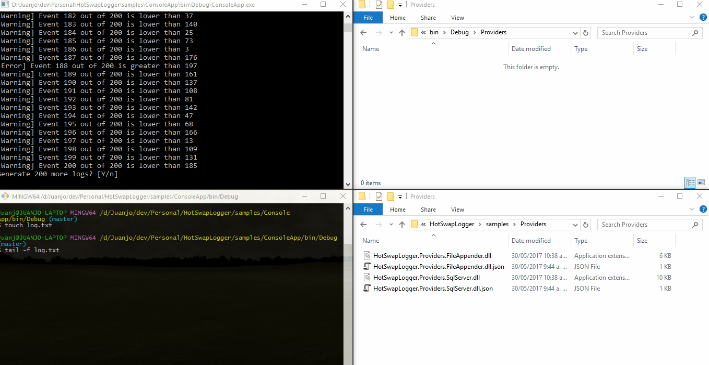
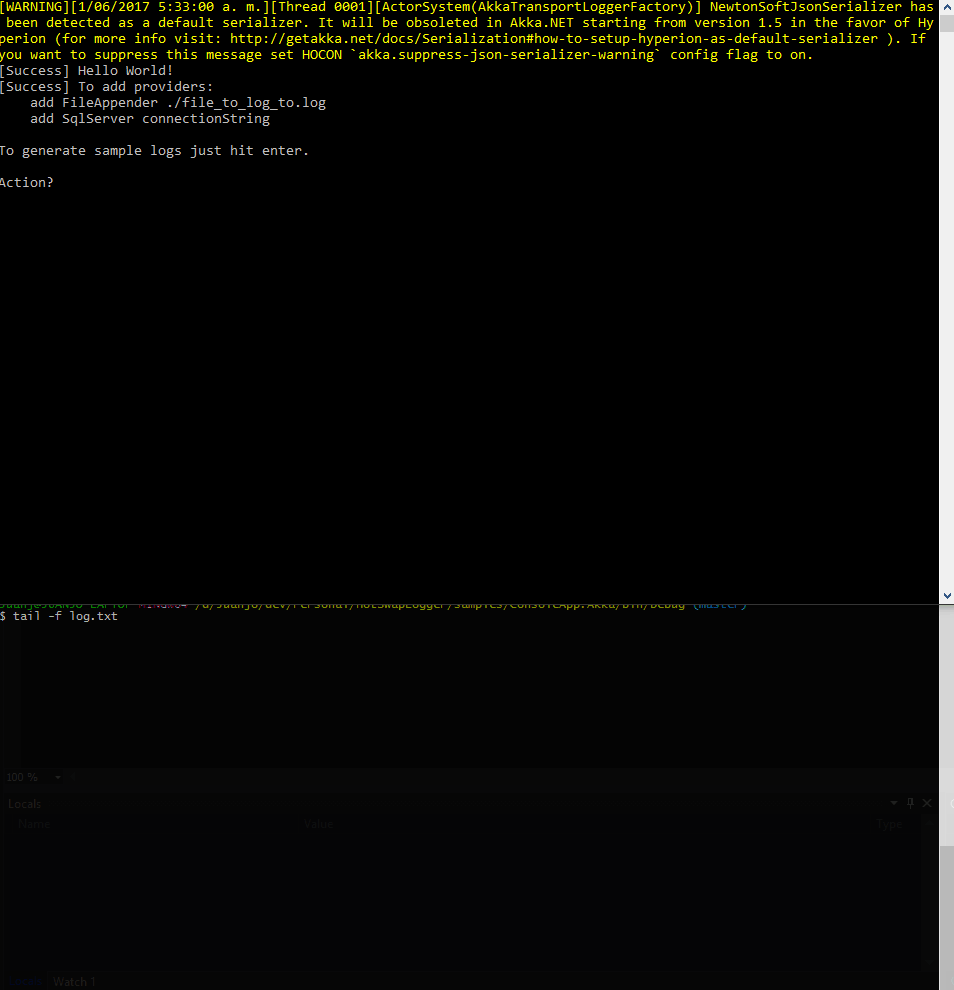

Hot Swap Logger?

# Basic Demo


# Using Akka as transport


# Logger Configuration
```csharp
var loggerFactory = new LoggerFactory()
    .AddConsole()
    .AddFileAppender(path: "./log.txt")
    .AddSqlServer(connectionString: "your connection string");

var logger = loggerFactory.CreateLogger();
```

# Watching and loading providers
```csharp
var watcher = new FileSystemWatcherWrapper();
var loader = new AssemblyLoaderWrapper();
var providerWatcher = new LoggerProviderWatcher(watcher, loader);

providerWatcher.Start(loggerFactory, pathToWatch);
```

Provider assemblies must implement `HotSwapLogger.ILoader` interface

# Running the ConsoleApp sample
`ConsoleApp.exe --pathToWatch C:\providers`

Copy the provider DLL to the watched path, make sure to include a JSON file wih the settings required by the provider, if any.

## FileAppender provider settings
```json
{
    "Path": "./log.txt" 
}
```

## SqlServer provider settings
```json
{
    "ConnectionString": "your connection string"
}
```

